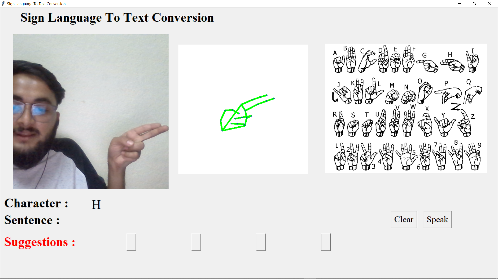
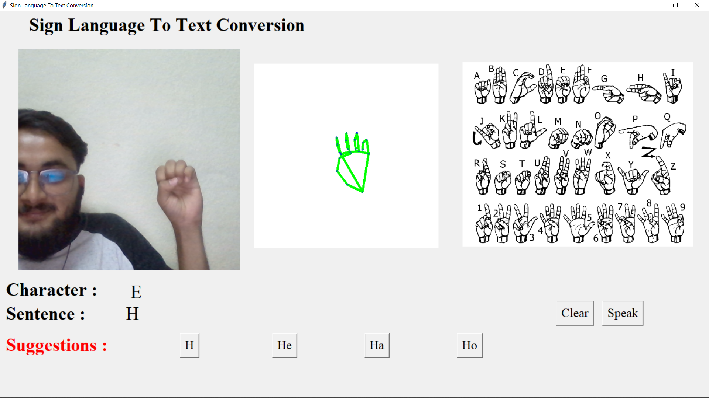
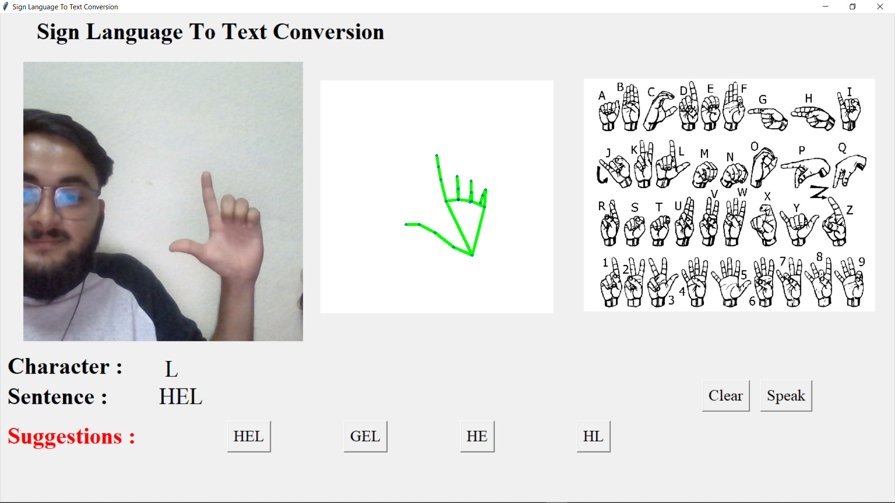
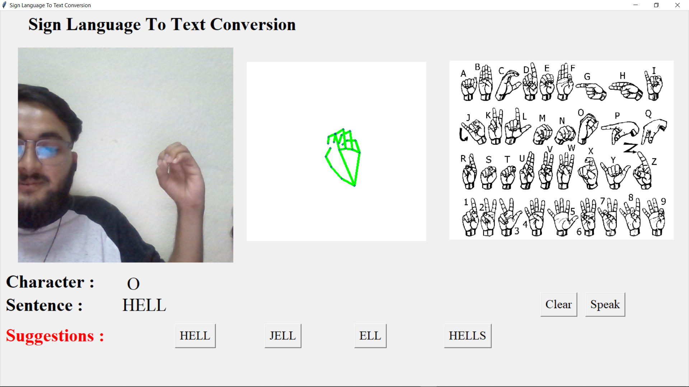

# American Sign Language Detection using CNN (Convolutional Neural Network) and Deep Learning.

This is my final year project on American Sign Language uses Convolutional Neural Networks (CNN) to recognize and translate ASL gestures into written text and Speech. The CNN model is trained on a large dataset of ASL images, and the project includes a user interface, image processing module, and database of signs and translations. The project aims to make ASL more accessible and improve communication between the deaf and hearing communities.
Certainly! The goal of the project is to develop a machine learning system that can accurately recognize and translate ASL gestures into written text, making the language more accessible to people who are not familiar with it.

To accomplish this, we are using a deep learning model called a Convolutional Neural Network (CNN), which is well-suited for image recognition tasks like ASL gesture recognition. The CNN model is trained on a large dataset of ASL images to learn the patterns and features of different ASL gestures.
The project includes several components, including a user interface that allows users to make ASL gestures using a webcam or other camera device, an image processing module that extracts features from the captured images, and a deep learning model that predicts the corresponding text based on the recognized gestures.

Additionally, the project includes a database of ASL signs and corresponding text translations, as well as a training module that allows the deep learning model to be updated with new data.

Overall, the project aims to improve communication and accessibility between the deaf and hearing communities by providing a tool that can accurately recognize and translate ASL gestures into written text.

### Getting Started
Follow the instructions from [Readme.file](./src/README.md)

## Output

## How it works

1. Webcam captures your hand in real time
2. MediaPipe extracts 21 hand landmark points
3. Landmarks are drawn as a skeleton on a blank canvas
4. A CNN classifies the skeleton into one of 8 visual groups
5. Geometry rules pick the exact letter within the group
6. Word suggestions (pyenchant) and text-to-speech (eSpeak) complete the experience

See [workflow.md](./workflow.md) for the full technical breakdown.

## Model performance

